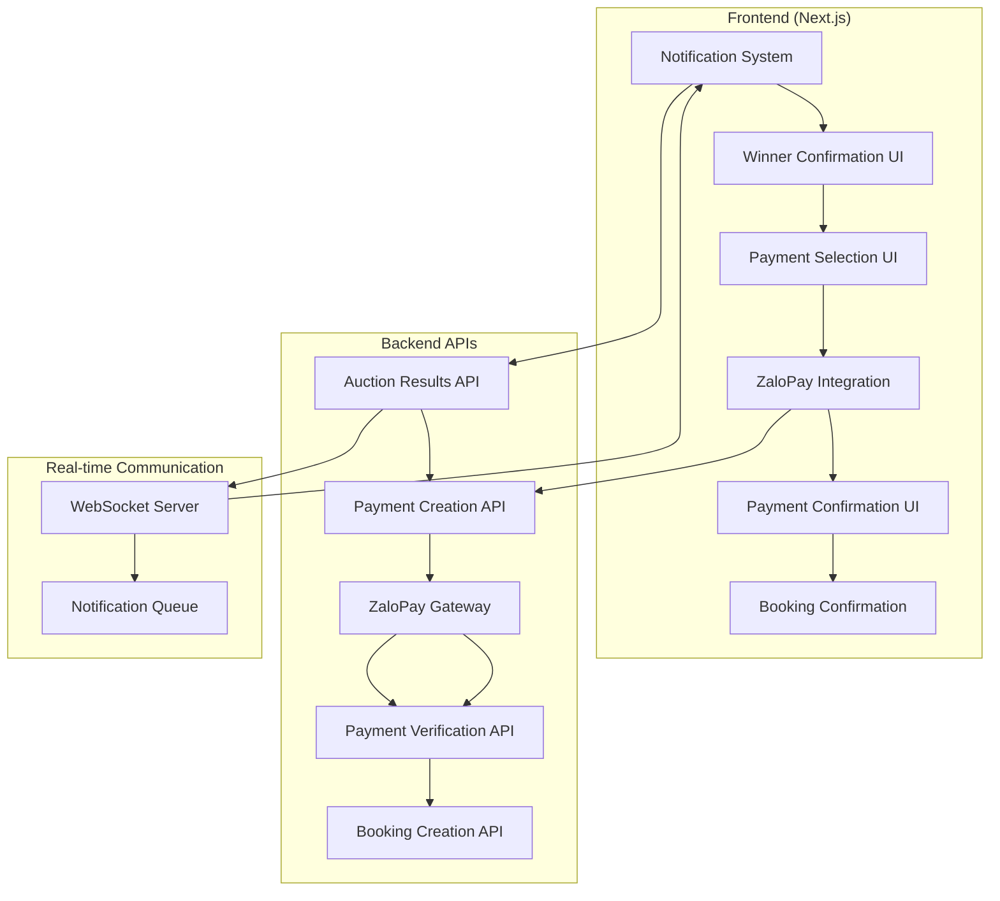
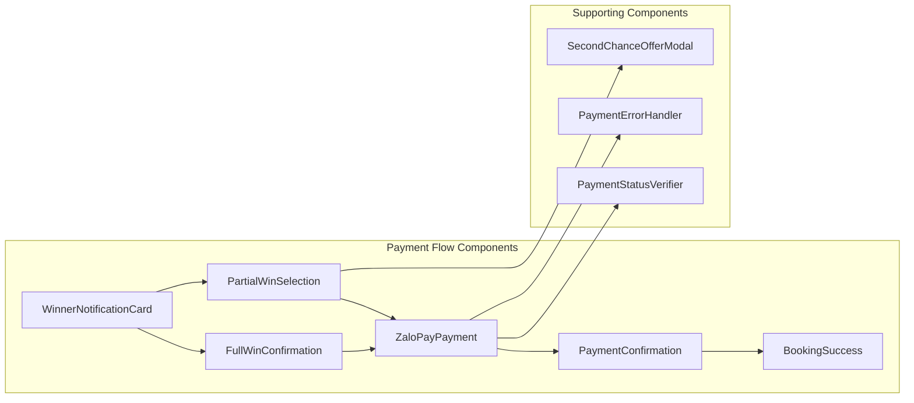
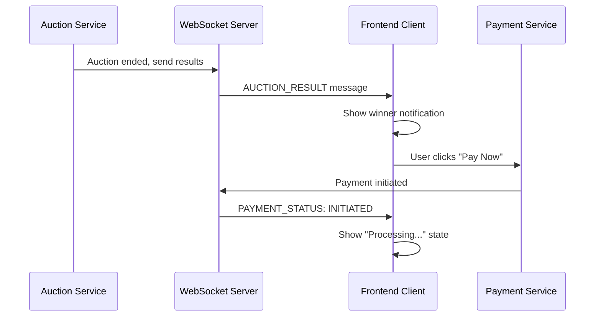
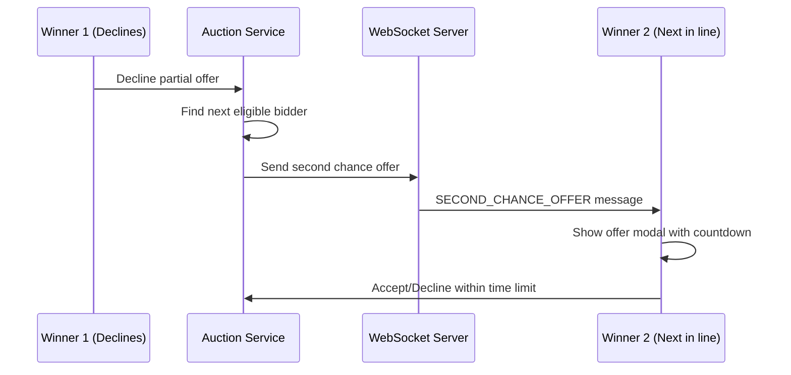
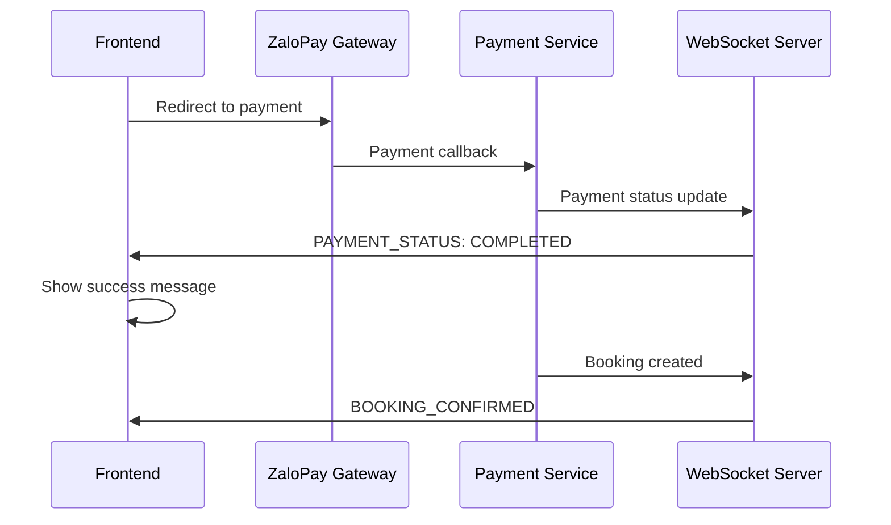

# Design Document

## Overview

This design implements ZaloPay payment integration for the auction-based Airbnb clone platform. The system handles payment processing for auction winners, including full bid winners, partial bid winners, and fallback mechanisms for declined offers. The design leverages the existing Next.js architecture, API patterns, and real-time communication infrastructure while introducing new payment-specific components and workflows.

## Architecture

### WebSocket Role in Payment Workflow

WebSocket plays several critical roles in the payment workflow:

1. **Real-time Auction Results**: When an auction ends, the backend determines winners and immediately pushes notifications via WebSocket to all participants
2. **Payment Status Updates**: Real-time updates on payment processing status (initiated, processing, completed, failed)
3. **Second Chance Offers**: Instant delivery of partial booking offers when previous winners decline
4. **Timeout Notifications**: Countdown timers for payment deadlines and offer response times
5. **Booking Confirmations**: Immediate confirmation when booking is successfully created after payment

### WebSocket Message Types

```typescript
// Auction result notification
interface AuctionResultMessage {
  type: 'AUCTION_RESULT'
  auctionId: string
  userId: string
  result: 'FULL_WIN' | 'PARTIAL_WIN' | 'LOST'
  awardedNights?: string[]
  amount: number
  paymentDeadline: string
}

// Second chance offer
interface SecondChanceMessage {
  type: 'SECOND_CHANCE_OFFER'
  offerId: string
  auctionId: string
  userId: string
  offeredNights: string[]
  amount: number
  responseDeadline: string
}

// Payment status update
interface PaymentStatusMessage {
  type: 'PAYMENT_STATUS'
  paymentId: string
  userId: string
  status: 'INITIATED' | 'PROCESSING' | 'COMPLETED' | 'FAILED'
  transactionId?: string
}

// Booking confirmation
interface BookingConfirmationMessage {
  type: 'BOOKING_CONFIRMED'
  bookingId: string
  userId: string
  propertyName: string
  checkIn: string
  checkOut: string
}
```

### High-Level Architecture



### Component Architecture



## Components and Interfaces

### 1. Core Payment Components

#### WinnerNotificationCard
**Purpose**: Display auction win notifications with payment actions
**Location**: `src/components/traveller/winner-notification-card.tsx`

```typescript
interface WinnerNotificationProps {
  auctionId: string
  propertyName: string
  propertyImage: string
  checkIn: string
  checkOut: string
  totalAmount: number
  isPartialWin: boolean
  partialNights?: PartialNight[]
  onPaymentClick: () => void
  onViewDetails: () => void
}

interface PartialNight {
  date: string
  pricePerNight: number
  isAwarded: boolean
}
```

#### FullWinConfirmation
**Purpose**: Confirmation screen for users who won their entire bid
**Location**: `src/components/traveller/full-win-confirmation.tsx`

```typescript
interface FullWinConfirmationProps {
  auction: AuctionDetails
  property: PropertyDetails
  bidAmount: number
  checkIn: string
  checkOut: string
  totalNights: number
  onProceedToPayment: () => void
  onDecline: () => void
}
```

#### PartialWinSelection
**Purpose**: Interface for users to select which partial nights to accept
**Location**: `src/components/traveller/partial-win-selection.tsx`

```typescript
interface PartialWinSelectionProps {
  auction: AuctionDetails
  property: PropertyDetails
  originalBid: BidDetails
  awardedNights: AwardedNight[]
  onSelectionChange: (selectedNights: AwardedNight[]) => void
  onProceedToPayment: (selectedNights: AwardedNight[]) => void
  onDeclineAll: () => void
}

interface AwardedNight {
  date: string
  pricePerNight: number
  isSelected: boolean
  rangeId: string // Groups consecutive nights
}
```

#### ZaloPayPayment
**Purpose**: ZaloPay payment integration component
**Location**: `src/components/payment/zalopay-payment.tsx`

```typescript
interface ZaloPayPaymentProps {
  bookingDetails: BookingDetails
  amount: number
  onPaymentSuccess: (transactionId: string) => void
  onPaymentError: (error: PaymentError) => void
  onPaymentCancel: () => void
}

interface BookingDetails {
  auctionId: string
  propertyId: string
  propertyName: string
  checkIn: string
  checkOut: string
  selectedNights: string[]
  guestCount: number
}
```

### 2. Payment Flow Pages

#### Winner Dashboard Page
**Location**: `src/app/dashboard/winners/page.tsx`
**Purpose**: Central hub for all winning bids and payment actions

#### Payment Processing Page
**Location**: `src/app/dashboard/payment/zalopay/page.tsx`
**Purpose**: ZaloPay payment processing interface

#### Payment Confirmation Page
**Location**: `src/app/dashboard/payment/confirmation/page.tsx`
**Purpose**: Payment verification and booking confirmation

### 3. WebSocket Integration Layer

#### Real-time Notification Hook
**Location**: `src/hooks/use-payment-notifications.ts`

```typescript
export const usePaymentNotifications = (userId: string) => {
  const [notifications, setNotifications] = useState<PaymentNotification[]>([])
  const [connectionStatus, setConnectionStatus] = useState<'connecting' | 'connected' | 'disconnected'>('connecting')
  
  useEffect(() => {
    const ws = new WebSocket(`${process.env.NEXT_PUBLIC_WS_URL}/payment-notifications`)
    
    ws.onopen = () => {
      setConnectionStatus('connected')
      ws.send(JSON.stringify({ type: 'SUBSCRIBE', userId }))
    }
    
    ws.onmessage = (event) => {
      const message = JSON.parse(event.data)
      handleNotificationMessage(message)
    }
    
    ws.onclose = () => {
      setConnectionStatus('disconnected')
      // Implement reconnection logic
    }
    
    return () => ws.close()
  }, [userId])
  
  const handleNotificationMessage = (message: PaymentNotificationMessage) => {
    switch (message.type) {
      case 'AUCTION_RESULT':
        setNotifications(prev => [...prev, {
          id: message.auctionId,
          type: 'WINNER',
          title: message.result === 'FULL_WIN' ? 'You won the auction!' : 'You won partial nights!',
          message: `Property: ${message.propertyName}`,
          amount: message.amount,
          actionRequired: true,
          timestamp: new Date().toISOString()
        }])
        break
      case 'SECOND_CHANCE_OFFER':
        setNotifications(prev => [...prev, {
          id: message.offerId,
          type: 'SECOND_CHANCE',
          title: 'Second chance offer!',
          message: `New offer for ${message.propertyName}`,
          amount: message.amount,
          actionRequired: true,
          expiresAt: message.responseDeadline,
          timestamp: new Date().toISOString()
        }])
        break
      case 'PAYMENT_STATUS':
        // Update existing notification or create new one
        updatePaymentStatus(message.paymentId, message.status)
        break
    }
  }
  
  return { notifications, connectionStatus, clearNotification }
}
```

#### WebSocket Message Handler
**Location**: `src/lib/websocket/payment-handler.ts`

```typescript
export class PaymentWebSocketHandler {
  private ws: WebSocket | null = null
  private reconnectAttempts = 0
  private maxReconnectAttempts = 5
  
  connect(userId: string, onMessage: (message: any) => void) {
    const wsUrl = `${process.env.NEXT_PUBLIC_WS_URL}/payment-notifications`
    this.ws = new WebSocket(wsUrl)
    
    this.ws.onopen = () => {
      this.reconnectAttempts = 0
      this.subscribe(userId)
    }
    
    this.ws.onmessage = (event) => {
      const message = JSON.parse(event.data)
      onMessage(message)
    }
    
    this.ws.onclose = () => {
      this.handleReconnection(userId, onMessage)
    }
  }
  
  private handleReconnection(userId: string, onMessage: (message: any) => void) {
    if (this.reconnectAttempts < this.maxReconnectAttempts) {
      this.reconnectAttempts++
      const delay = Math.pow(2, this.reconnectAttempts) * 1000 // Exponential backoff
      setTimeout(() => this.connect(userId, onMessage), delay)
    }
  }
  
  private subscribe(userId: string) {
    if (this.ws?.readyState === WebSocket.OPEN) {
      this.ws.send(JSON.stringify({
        type: 'SUBSCRIBE',
        userId,
        channels: ['auction_results', 'payment_status', 'second_chance_offers']
      }))
    }
  }
  
  disconnect() {
    if (this.ws) {
      this.ws.close()
      this.ws = null
    }
  }
}
```

### 4. API Integration Layer

#### Payment API Service
**Location**: `src/lib/api/payment.ts`

```typescript
export const paymentApi = {
  // Create ZaloPay payment order
  createPayment: async (paymentData: CreatePaymentRequest): Promise<CreatePaymentResponse> => {
    return apiClient.post('/payment/zalopay/create', paymentData, { requireAuth: true })
  },

  // Verify payment status
  verifyPayment: async (appTransId: string): Promise<PaymentStatusResponse> => {
    return apiClient.get(`/payment/zalopay/status/${appTransId}`, { requireAuth: true })
  },

  // Handle payment callback
  handleCallback: async (callbackData: PaymentCallbackData): Promise<void> => {
    return apiClient.post('/payment/zalopay/callback', callbackData, { requireAuth: true })
  }
}

interface CreatePaymentRequest {
  auctionId: string
  selectedNights: string[]
  amount: number
  orderInfo: string
}

interface CreatePaymentResponse {
  orderUrl: string
  appTransId: string
  amount: number
}

interface PaymentStatusResponse {
  status: 'PAID' | 'PENDING' | 'FAILED' | 'CANCELLED'
  transactionId?: string
  amount?: number
  paidAt?: string
}
```

#### Auction Winner API Service
**Location**: `src/lib/api/auction-winners.ts`

```typescript
export const auctionWinnerApi = {
  // Get user's winning bids
  getWinningBids: async (): Promise<WinningBid[]> => {
    return apiClient.get('/auctions/winners/me', { requireAuth: true })
  },

  // Accept partial offer
  acceptPartialOffer: async (offerId: string, selectedNights: string[]): Promise<void> => {
    return apiClient.post(`/auctions/offers/${offerId}/accept`, { selectedNights }, { requireAuth: true })
  },

  // Decline partial offer
  declinePartialOffer: async (offerId: string): Promise<void> => {
    return apiClient.post(`/auctions/offers/${offerId}/decline`, {}, { requireAuth: true })
  },

  // Get second chance offers
  getSecondChanceOffers: async (): Promise<SecondChanceOffer[]> => {
    return apiClient.get('/auctions/offers/second-chance/me', { requireAuth: true })
  }
}

interface WinningBid {
  id: string
  auctionId: string
  property: PropertyDetails
  bidAmount: number
  checkIn: string
  checkOut: string
  isPartialWin: boolean
  awardedNights: AwardedNight[]
  status: 'PENDING_PAYMENT' | 'PAID' | 'EXPIRED'
  paymentDeadline: string
}
```

## Data Models

### Payment-Related Types
**Location**: `src/types/payment.ts`

```typescript
export interface PaymentSession {
  id: string
  auctionId: string
  userId: string
  amount: number
  currency: 'VND'
  status: PaymentStatus
  appTransId: string
  orderUrl?: string
  createdAt: string
  expiresAt: string
}

export type PaymentStatus = 'CREATED' | 'PENDING' | 'PAID' | 'FAILED' | 'CANCELLED' | 'EXPIRED'

export interface PaymentError {
  code: string
  message: string
  details?: any
}

export interface ZaloPayConfig {
  appId: string
  key1: string
  key2: string
  endpoint: string
  callbackUrl: string
  redirectUrl: string
}
```

### Auction Winner Types
**Location**: `src/types/auction-winners.ts`

```typescript
export interface AuctionWinner {
  id: string
  auctionId: string
  userId: string
  bidId: string
  winType: 'FULL' | 'PARTIAL'
  awardedNights: string[]
  totalAmount: number
  status: WinnerStatus
  notifiedAt?: string
  respondedAt?: string
  paymentDeadline: string
}

export type WinnerStatus = 'NOTIFIED' | 'CONFIRMED' | 'DECLINED' | 'PAID' | 'EXPIRED'

export interface SecondChanceOffer {
  id: string
  originalBidId: string
  userId: string
  auctionId: string
  offeredNights: string[]
  amount: number
  responseDeadline: string
  status: 'WAITING' | 'ACCEPTED' | 'DECLINED' | 'EXPIRED'
}
```

## Error Handling

### Payment Error Scenarios

1. **Payment Creation Failure**
   - Network connectivity issues
   - Invalid payment data
   - ZaloPay service unavailable
   - User authentication problems

2. **Payment Processing Errors**
   - User cancels payment on ZaloPay
   - Insufficient funds
   - Card/payment method issues
   - Payment timeout

3. **Payment Verification Issues**
   - Callback verification failure
   - Status query timeout
   - Inconsistent payment status
   - Database update failures

### Error Recovery Strategies

```typescript
// Error handling utility
export class PaymentErrorHandler {
  static handlePaymentError(error: PaymentError): PaymentErrorAction {
    switch (error.code) {
      case 'PAYMENT_CREATION_FAILED':
        return { type: 'RETRY', message: 'Unable to create payment. Please try again.' }
      case 'PAYMENT_CANCELLED':
        return { type: 'RETURN_TO_SELECTION', message: 'Payment was cancelled.' }
      case 'PAYMENT_TIMEOUT':
        return { type: 'VERIFY_STATUS', message: 'Payment is taking longer than expected.' }
      case 'INSUFFICIENT_FUNDS':
        return { type: 'SHOW_ERROR', message: 'Insufficient funds. Please try a different payment method.' }
      default:
        return { type: 'SHOW_ERROR', message: 'An unexpected error occurred. Please contact support.' }
    }
  }
}

interface PaymentErrorAction {
  type: 'RETRY' | 'RETURN_TO_SELECTION' | 'VERIFY_STATUS' | 'SHOW_ERROR'
  message: string
}
```

## Testing Strategy

### Unit Testing

1. **Component Testing**
   - Winner notification rendering
   - Partial night selection logic
   - Payment form validation
   - Error state handling

2. **API Integration Testing**
   - Payment creation API calls
   - Status verification logic
   - Error response handling
   - Authentication token management

3. **Utility Function Testing**
   - Payment amount calculations
   - Date range processing
   - Error handling utilities
   - ZaloPay integration helpers

### Integration Testing

1. **Payment Flow Testing**
   - End-to-end payment process
   - Callback handling
   - Status synchronization
   - Booking creation after payment

2. **Real-time Communication Testing**
   - WebSocket notification delivery
   - Second chance offer notifications
   - Payment status updates
   - Connection recovery

### E2E Testing Scenarios

1. **Full Bid Winner Flow**
   - Receive notification → Confirm → Pay → Success
   - Receive notification → Confirm → Pay → Failure → Retry

2. **Partial Bid Winner Flow**
   - Receive partial offer → Select nights → Pay → Success
   - Receive partial offer → Decline → Fallback triggered

3. **Second Chance Offer Flow**
   - Receive second chance → Accept → Pay → Success
   - Receive second chance → Timeout → Next bidder notified

## WebSocket Integration Workflow

### 1. Auction Completion Flow


### 2. Second Chance Offer Flow


### 3. Real-time Payment Status Updates


## Implementation Phases

### Phase 1: Core Payment Infrastructure
- ZaloPay API integration
- Payment creation and verification
- Basic error handling
- Database schema updates

### Phase 2: Winner Notification System
- WebSocket notification integration
- Winner dashboard page
- Notification components
- Real-time status updates

### Phase 3: Payment UI Components
- Full win confirmation screen
- Partial win selection interface
- ZaloPay payment component
- Payment confirmation page

### Phase 4: Advanced Features
- Second chance offer system
- Fallback mechanisms
- Enhanced error handling
- Payment retry logic

### Phase 5: Testing and Optimization
- Comprehensive testing suite
- Performance optimization
- Security hardening
- User experience refinements

## Security Considerations

### Payment Security
- HTTPS enforcement for all payment-related requests
- Secure token handling for ZaloPay integration
- Payment callback signature verification
- Sensitive data encryption in transit and at rest

### Authentication & Authorization
- JWT token validation for all payment APIs
- User ownership verification for auction bids
- Payment session validation
- Rate limiting for payment attempts

### Data Protection
- PCI DSS compliance considerations
- Payment data minimization
- Audit logging for all payment transactions
- Secure error message handling (no sensitive data exposure)

## Performance Considerations

### Frontend Optimization
- Lazy loading of payment components
- Optimistic UI updates for better UX
- Caching of auction and property data
- Efficient re-rendering with React optimization

### Backend Integration
- Connection pooling for database operations
- Caching of frequently accessed data
- Asynchronous processing for non-critical operations
- Retry mechanisms with exponential backoff

### Real-time Communication
- WebSocket connection management
- Message queuing for reliable delivery
- Connection recovery strategies
- Efficient notification batching